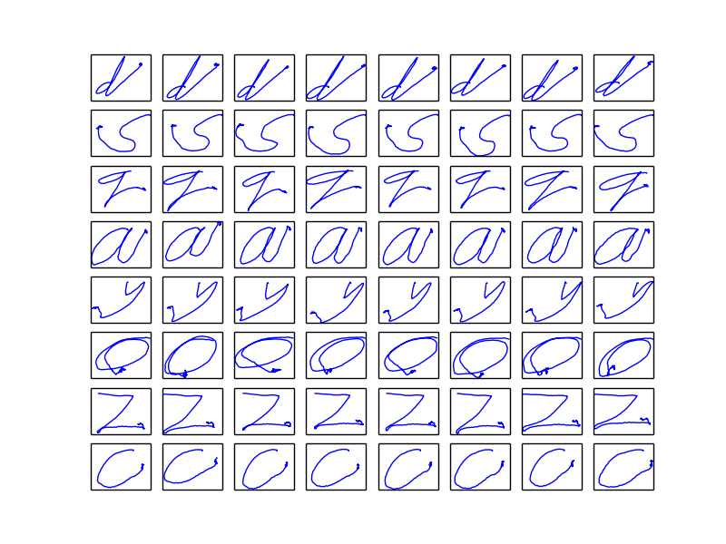
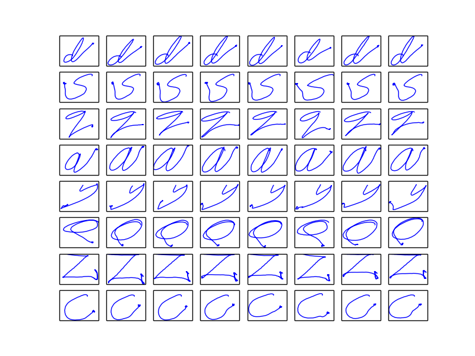
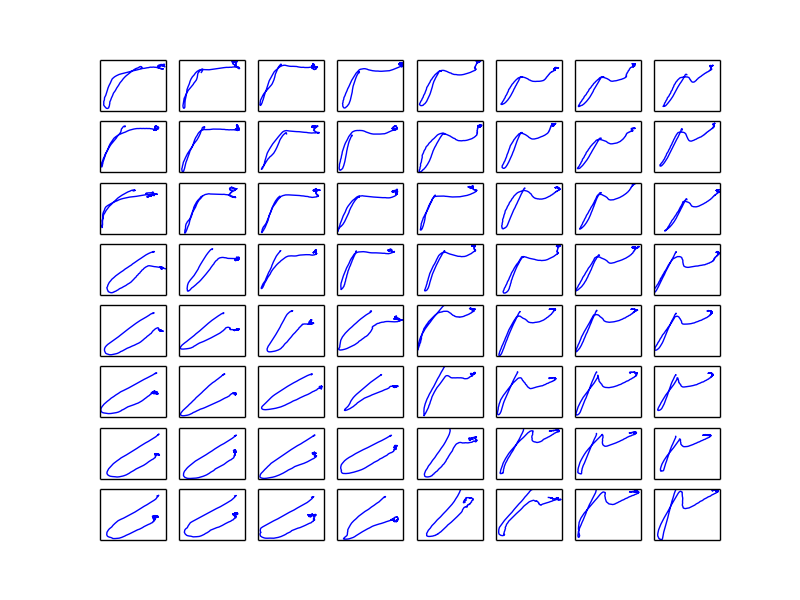
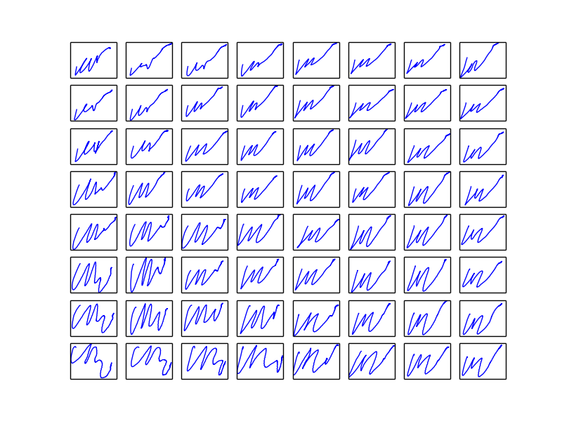

# InfoGAN for temporal series generation

## Introduction

Use infoGAN to generate **multi-dimentional temporal sequences**.

In MNIST, continuous noise can represent character width and rotation angle. But in here, their meanings are not quite intuitive.

In MNIST, modifying continuous noise would not change the classtype of generated samples. But in here, it happens.

See codes for MNIST at https://github.com/SongDark/GAN_collections.

## Datasets

Name | Link | Class | Dimension | Train Size | Test Size | Truncated
:---: | :---: | :---: | :---: | :---: | :---: | :---:
CharacterTrajectories | [Download](http://timeseriesclassification.com/description.php?Dataset=CharacterTrajectories) | 20 | 3 | 1422 | 1436 | 182

### Generate npz file

Unzip *CharacterTrajectories.zip* at  `data/CharacterTrajectories`, then run `dataprocess.py`.

```python
    python dataprocess.py
```

## Generated Images

### Random noise, Random discrete code, Fixed continuous code

Epoch 0 | Epoch 200 | Epoch 500
:---: | :---: | :---:
 |  | 

### Specified condition, Random noise

Epoch 0 | Epoch 200 | Epoch 500
:---: | :---: | :---:
 |  | 

### Fixed noise

It seems that the generated sequences are not corresponding to their one-hot labels.

label=14(*s*) | label=16(*v*) | label=16(*y*)
:---: | :---: | :---:
 |  | 

## Reference 
https://github.com/hwalsuklee/tensorflow-generative-model-collections/blob/master/infoGAN.py

https://github.com/buriburisuri/timeseries_gan/blob/master/train.py